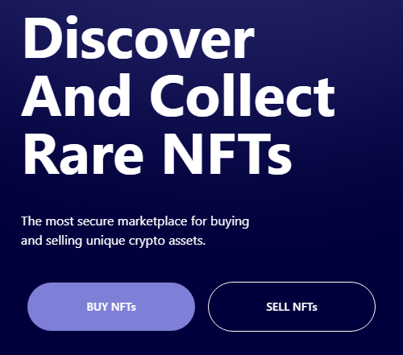

# KRYPTO Home Page
Simple Home Page

## Características
- [x] Figma Design
- [x] Figma to React Design
- [x] Responsive Design

## Dependencias
- Vite
- React
- React Icons
- TailWindCSS
- TailWind Scrollbar

## Descripción

En este proyecto se diseñó una página web utilizando [Figma](figma.com) para posteriormente traducir el diseño a código de React y [Tailwind](https://tailwindcss.com/docs/guides/vite). Esto permitió crear un diseño web responsivo que se adapta a las pantallas de los distintos dispositivos desde los cuales se visualiza la página web. El diseño de la página web se lo hizo con la guía de [Flux Academy: Figma Tutorial - YouTube](https://www.youtube.com/watch?v=HZuk6Wkx_Eg) para crear un diseño web moderno y de calidad profesional.

<div align="center">

</div>

🚀 Visualiza el demo de Krypto [aquí](https://da8ah.github.io/react-krypto-home/)

📂 Descarga el diseño en Figma [aquí](./doc/krypto.fig)

## Instalación

- PNPM
```bash
$ npm i --location=global pnpm
```
- Instalar dependencias y Ejecutar
```bash
$ git clone https://github.com/da8ah/react-krypto-home.git
$ pnpm install
$ pnpm run dev
```

## Resultado

### Diseño Responsivo (React)

|Mobile|Tablet|Desktop|
|:------------:|:------------:|:------------:|
||||
<br/>

### Animaciones

Mobile Navbar

<div align="center" style="width:100%;display:flex;flex-direction:row;justify-content:space-evenly;align-items:flex-start;">


</div>
<br/>

Button Color Hover

<div align="center" style="width:100%;display:flex;flex-direction:row;justify-content:space-evenly;align-items:flex-start;">


</div>
<br/>
<br/>

## Versionamiento

(Tiber) **Abril 2023 v1.0.0**
* Navbar
* Hero Section
* Brands
* Features
* Testimonials
* Call to Action
* Footer